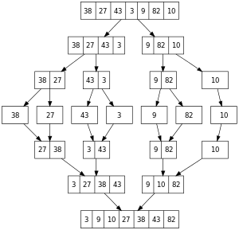
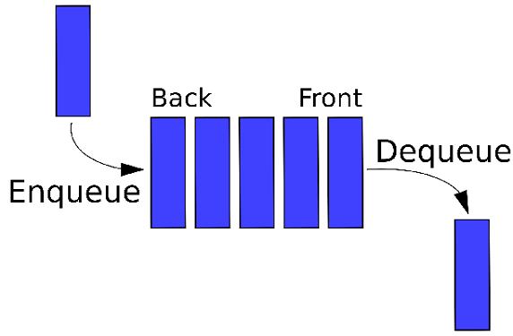
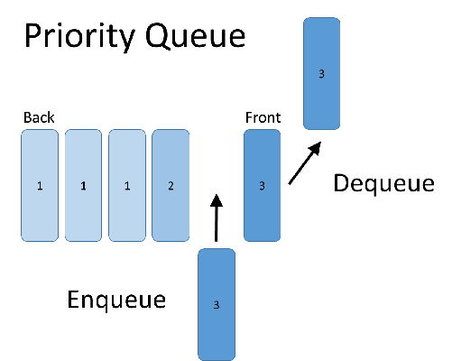
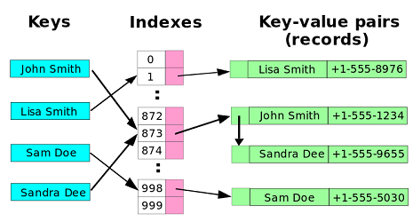
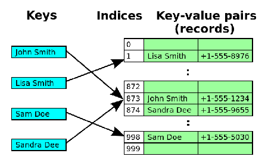
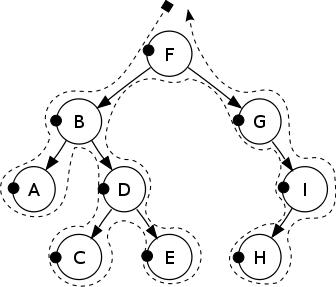
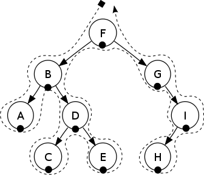

# Data Structures
All of these data structures (plus some others) implemented in a bunch of languages listed [here](https://github.com/zckeyser/all-the-structures/blob/master/language_roadmap.md).

## Table of Contents
  - [Sorts](##sorts)
    - [Bubble Sort](#bubble-sort)
    - [Insertion Sort](#insertion-sort)
    - [Selection Sort](#selection-sort)
    - [Merge Sort](#merge-sort)
    - [Quick Sort](#quick-sort)
  - [Stacks and Queues](#stacks-and-queues)
    - [Stack](#stack)
    - [Queue](#queue)
    - [Priority Queue](#priority-queue)
  - [Dictionary](#dictionary)
  - [Trees](#trees)
    - [Binary Tree](#binary-tree)
    - [Binary Search Tree](#binary-search-tree)
  - [Tree Traversal](#tree-traversal)
    - [Preorder](#preorder)
    - [Inorder](#inorder)
    - [Postorder](#postorder)
  - [Directed Graph Traversals](#directed-graph-traversals)
    - [Breadth-First](#breadth-first)
    - [Depth-First](#depth-first)
  - [List Searches](#list-searches)
    - [Linear](#linear)
    - [Binary](#binary)
  - [Math Algorithms](#math-algorithms)
    - [Euclidean Algorithm](#euclidean-algorithm)
    - [Sieve of Eratosthenes](#sieve-of-eratosthenes)

## Sorts

### Bubble Sort


[Bubble Sort](https://en.wikipedia.org/wiki/Bubble_sort) is a simple sorting algorithm which merely goes through an array, and for each item checks if it is out of order compared to the item after it. If the items are out of order, swap them. This process is repeated until the entire array is sorted. Bubble sort's only real boon is its simplicity, because it is far too inefficient to have any practical use cases.

#### Efficiency
Best Case: Ω(n)

Average Case: O(n<sup>2</sup>)

Worst Case: O(n<sup>2</sup>)

Space Complexity: O(1)

### Insertion Sort


[Insertion Sort](https://en.wikipedia.org/wiki/Insertion_sort) is another simple sorting algorithm, albeit more complex than Bubble Sort. Insertion Sort works by going through the array one element at a time, shifting that element back until it's in order compared to the elements behind it. This works because it effectively creates a growing sorted sub-array one element at a time as it goes through. Insertion Sort is a rather inefficient sort, which doesn't see much practical use. While better than Bubble Sort, it still has an average case of O(n<sup>2</sup>) which is very inefficient.

#### Efficiency
Best Case: Ω(n)

Average Case: O(n<sup>2</sup>)

Worst Case: O(n<sup>2</sup>)

Space Complexity: O(1)

### Selection Sort


[Selection Sort]()

### Merge Sort


[Merge Sort](https://en.wikipedia.org/wiki/Merge_sort) is a performant recursive sorting algorithm. Merge Sort functions off of the notion that an array of size 1 must be sorted, therefore by merging up from subarrays of size 1 we can end up with a sorted array. This is done through a `merge` function, which takes two sorted arrays as input and returns a single sorted array as output. Merge Sort recursively calls itself on the left and right half of the array passed into it, merging the results. Because Merge Sort always requires the same number of partitions for an array of any given size, its Best, Worst, and Average case are all the same at `O(log(n))`. However, Merge Sort has much higher space usage than QuickSort at `O(n)` because it needs to copy its subarrays, whereas QuickSort performs its swaps in place. In addition, the mechanisms behind Merge Sort are much harder for a processor to  perform efficiently compared to QuickSort. As a result, Merge Sort doesn't see too much real-world usage.

#### Efficiency
Best Case: Ω(n log(n))

Average Case: Θ(n log(n))

Worst Case: O(n log(n))

Space Complexity: O(n)

### QuickSort


[QuickSort](https://en.wikipedia.org/wiki/Quicksort), sometimes referred to as qsort, is the most commonly used real-world sorting algorithm, seeing use in the standard libraries of a number of popular languages such as C# (in Array.Sort()).

Like Merge Sort, QuickSort works by partitioning the array. Unlike Merge Sort, QuickSort focuses on sorting arrays as they are partitioned rather than as they are merged. QuickSort is a recursive algorithm where the given array has an element chosen at random called a *pivot*. The array is then partitioned such that all elements less than the pivot value are on the left of the pivot, and all those greater are on the right. The left and right subarrays then have QuickSort called on them before they are merged. This process is repeated until the array which QuickSort is being called of has a size of 1 or is empty, at which time it is returned as-is. As a result of this, QuickSort has an average case efficiency of `O(nlog(n))`, which is on par with other high-performance sorting algorithms such as Merge Sort. This is because on average it takes `log(n)` partitions to sort the array, and each partition takes `n` time to perform (as it needs to go through every element in the array being partitioned).

#### Efficiency
Best Case: Ω(n log(n))

Average Case: Θ(n log(n))

Worst Case: O(n<sup>2</sup>)

Space Complexity: O(log(n))

---

## Stacks and Queues

### Stack


A [stack](http://www.studytonight.com/data-structures/stack-data-structure) is a basic data structure which has two operations: `push` and `pop`. `push` adds an item to the stack, and `pop` removes the last item pushed onto the stack. Stacks have many uses (such as in a non-recursive Depth First Search) and are a key data structure in most languages (e.g. C). Commonly stacks are referred to as a *Last-In First-Out (LIFO)* data structure, due to the way that the last item added to it is the first item removed.

### Queue


A [queue](http://www.studytonight.com/data-structures/queue-data-structure) is another data structure which has two operations: `enqueue` and `dequeue`. `enqueue` adds an item to the queue, and `dequeue` removes the first item that has been added to the queue but has not been dequeued. As a result of this, queues are commonly referred to as *First-In-First-Out (FIFO)*, a reversal of the LIFO label put on stacks. There are many practical usages for queues, with an example being a worker queue, where items are put onto a queue and different workers remove the items and perform work on them until the queue is empty.

### Priority Queue


A [priority queue](https://en.wikipedia.org/wiki/Priority_queue) is a data structure which is essentially a more advanced version of a queue. Like a queue, priority queues are FIFO. However, priority queues remove high priority items before low priority items. The priority of an item must be given when the item is queued, so the priority queue can know how to classify it.

---

## Dictionary
A [dictionary](https://en.wikibooks.org/wiki/Data_Structures/Hash_Tables) (also known as a map, hash map or hash table) is a structure which stores key-value pairs such that given a key, the map will return the corresponding value. This is done by *hashing* the key, which refers to using a function to reduce an object to a relatively small object of a consistent type. The hash functions used by a dictionary reduce objects to an integer so they can be used to access an index on the internal array, where each slot in the array is referred to as a *bucket*.

Sometimes, two different objects can produce the same key (since the hash value needs to have its range reduced to fit in the internal array). This is called a *collision*. There are two strategies commonly used to handle collisions:

### Chaining


The Chaining strategy for collisions is to make every bucket a linked list. When you get a collision, you just look through the list to see if the key already exists. For a set, if the key exists you change that pair's value, otherwise you append the new value to end of that bucket's list. For a get, you return the value of the key-value pair in the list if you find it, otherwise you return null/throw for not found/etc.

### Open Addressing


The Open Addressing strategy for collisions is to keep just a single key-value pair in each bucket, and on a collision search through other buckets until you find an open one. Once the internal array gets full, it gets re-instanced to a larger size then all the existing objects get re-inserted into the Dictionary.

---

## Trees

### Binary Tree

A [Binary Tree]()

### Binary Search Tree


---

## Tree Traversal
Tree traversals are ways of traversing through all the nodes in a binary tree in a certain order. There are 5 types of tree traversals: Pre-order, In-order, Post-order, Depth-first and Breadth-first. Depth and Breadth-first searches are covered in [Directed Graph Traversals](#directed-graph-traversals), but the other three are covered below.

### Pre-order


Pre-order traverses the tree in the order: parent left right. This means that first comes the parent's data, then the pre-order traversal of the left subtree, then the pre-order traversal of the right subtree.

### In-order



In-order traverses the tree in the order: left parent right. This means that first the left subtree's in-order traversal, then the parent's data, then the right subtree's in-order traversal. A noteworthy aspect of in-order traversals is that an in-order traversal of a binary search tree yields a sorted list of the numbers in the binary search tree.

### Post-order


Post-order traverses the tree in the order: left right parent. This means that first comes the post-order traversal of the left subtree, preorder traversal of the right subtree, then the parent's data.

---

## Directed Graph Traversals

### Breadth-First

### Depth-First

---

## List Searches

### Linear Search
[Linear Search](https://en.wikipedia.org/wiki/Linear_search) is the simplest way to search a list. It simply consists of checking each item of the list, in order, and returning the index it finds the target at. If the target is not found, it returns -1.

#### Efficiency
Worst Case: O(n)

### Binary Search
[Binary Search](https://en.wikipedia.org/wiki/Binary_search_algorithm) is a search algorithm which requires that the list being searched is sorted, and the type of object in the list be comparable. In binary search, the section of the list is cut in half on each iteration. On each iteration, the midpoint of the current left and right bounds is checked. If the target is less than the value at the midpoint, the left side is searched, otherwise the right side is searched. This continues until the left and right bounds are equal or the item is found.

#### Efficiency
Worst Case: O(log(n))

--

## Math Algorithms

### Euclidean Algorithm
[The Euclidean algorithm](https://www.khanacademy.org/computing/computer-science/cryptography/modarithmetic/a/the-euclidean-algorithm) is an efficient algorithm to determine the Greatest Common Denominator (GCD) of two numbers. The Euclidean algorithm works by repeatedly modulo-ing two numbers into each other with recursive calls until one divides into the other evenly. For example, a walk-through of GCD(3168, 61816) might look like the following:
```
(3168, 61816) // a < b, call again with them swapped
(61816, 3168) // call with (a % b, b)
(1624, 3168) // repeat aforementioned steps
(3168, 1624)
(1544, 1624)
(1624, 1544)
(80, 1544)
(1544, 80)
(24, 80)
(80, 24)
(8, 24)
(24, 8) // 24 % 8 == 0, therefore the GCD is 8
```

### Sieve of Eratosthenes
[The Sieve of Eratosthenes](https://en.wikipedia.org/wiki/Sieve_of_Eratosthenes) is a prime sieve which finds all primes up to a given number N. This sieve works by taking a list of all numbers from [2..N - 1], then for every number in the range [2..N / 2] crossing out (removing) every number in the list which can be evenly divided by the current number. The numbers checked for division are also numbers in the prime list, such that if a number is crossed out from the prime list you no longer need to check if other numbers are divisible by it (any numbers that would be should already have been crossed out by its divisor). Once every number up to N / 2 has been checked, the remaining numbers are known to be primes. An example of the sieve working for 1..30 is as follows:

```
[2 3 4 5 6 7 8 9 10 11 12 13 14 15 16 17 18 19 20 21 22 23 24 25 26 27 28 29 30] // beginning list
[2 3 5 7 9 11 13 15 17 19 21 23 25 27 29] // remove all numbers divisible by 2
[2 3 5 7 11 13 17 19 23 25 29] // remove all numbers divisible by 3
[2 3 5 7 11 13 17 19 23 29] // remove all numbers divisible by 5
[2 3 5 7 11 13 17 19 23 29] // remove all numbers divisible by 7
[2 3 5 7 11 13 17 19 23 29] // remove all numbers divisible by 11
[2 3 5 7 11 13 17 19 23 29] // remove all numbers divisible by 13 -- we're done now
```
