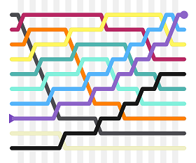
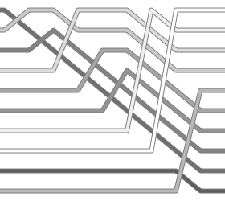
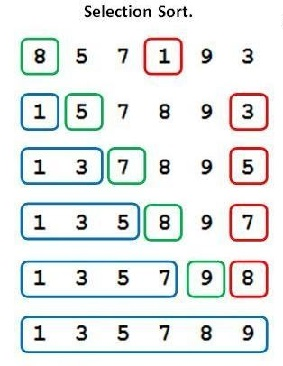

# Data Structures

## Table of Contents
  - [Sorts](##sorts)
    - [Bubble Sort](#bubble-sort)
    - [Insertion Sort](#insertion-sort)
    - [Selection Sort](#selection-sort)
    - [Merge Sort](#merge-sort)
    - [Quick Sort](#quick-sort)
  - [Stacks and Queues](#stacks-and-queues)
    - [Stack](#stack)
    - [Queue](#queue)
    - [Priority Queue](#priority-queue)
  - [Dictionary](#dictionary)
  - [Trees](#trees)
    - [Binary Tree](#binary-tree)
    - [Binary Search Tree](#binary-search-tree)
  - [Tree Traversal](#tree-traversal)
    - [Preorder](#preorder)
    - [Inorder](#inorder)
    - [Postorder](#postorder)
  - [Directed Graph Traversals](#directed-graph-traversals)
    - [Breadth-First](#breadth-first)
    - [Depth-First](#depth-first)
  - [List Searches](#list-searches)
    - [Linear](#linear)
    - [Binary](#binary)
  - [Math Algorithms](#math-algorithms)
    - [Euclidean Algorithm](#euclidean-algorithm)
    - [Sieve of Eratosthenes](#sieve-of-eratosthenes)

## Sorts

### Bubble Sort

[Bubble Sort](https://en.wikipedia.org/wiki/Bubble_sort) is a simple sorting algorithm which merely goes through an array, and for each item checks if it is out of order compared to the item after it. If the items are out of order, swap them. This process is repeated until the entire array is sorted. Bubble sort's only real boon is its simplicity, because it is far too inefficient to have any practical use cases.

#### Efficiency
Best Case: Ω(n)

Average Case: O(n2)

Worst Case: O(n2)

Space Complexity: O(1)

### Insertion Sort

[Insertion Sort](https://en.wikipedia.org/wiki/Insertion_sort) is another simple sorting algorithm, albeit more complex than Bubble Sort. Insertion Sort works by going through the array one element at a time, shifting that element back until it's in order compared to the elements behind it. This works because it effectively creates a growing sorted sub-array one element at a time as it goes through. Insertion Sort is a rather inefficient sort, which doesn't see much practical use. While better than Bubble Sort, it still has an average case of O(n2) which is very inefficient.

#### Efficiency
Best Case: Ω(n)

Average Case: O(n2)

Worst Case: O(n2)

Space Complexity: O(1)

### Selection Sort

[Selection Sort]()

### Merge Sort

[Merge Sort](https://en.wikipedia.org/wiki/Merge_sort) is a performant recursive sorting algorithm. Merge Sort functions off of the notion that an array of size 1 must be sorted, therefore by merging up from subarrays of size 1 we can end up with a sorted array. This is done through a `merge` function, which takes two sorted arrays as input and returns a single sorted array as output. Merge Sort recursively calls itself on the left and right half of the array passed into it, merging the results. Because Merge Sort always requires the same number of partitions for an array of any given size, its Best, Worst, and Average case are all the same at `O(log(n))`. However, Merge Sort has much higher space usage than QuickSort at `O(n)` because it needs to copy its subarrays, whereas QuickSort performs its swaps in place. In addition, the mechanisms behind Merge Sort are much harder for a processor to  perform efficiently compared to QuickSort. As a result, Merge Sort doesn't see too much real-world usage.

#### Efficiency
Best Case: Ω(n log(n))

Average Case: Θ(n log(n))

Worst Case: O(n log(n))

Space Complexity: O(n)

### QuickSort

[QuickSort](https://en.wikipedia.org/wiki/Quicksort), sometimes referred to as qsort, is the most commonly used real-world sorting algorithm, seeing use in the standard libraries of a number of popular languages such as C# (in Array.Sort()).

Like Merge Sort, QuickSort works by partitioning the array. Unlike Merge Sort, QuickSort focuses on sorting arrays as they are partitioned rather than as they are merged. QuickSort is a recursive algorithm where the given array has an element chosen at random called a *pivot*. The array is then partitioned such that all elements less than the pivot value are on the left of the pivot, and all those greater are on the right. The left and right subarrays then have QuickSort called on them before they are merged. This process is repeated until the array which QuickSort is being called of has a size of 1 or is empty, at which time it is returned as-is. As a result of this, QuickSort has an average case efficiency of `O(nlog(n))`, which is on par with other high-performance sorting algorithms such as Merge Sort. This is because on average it takes `log(n)` partitions to sort the array, and each partition takes `n` time to perform (as it needs to go through every element in the array being partitioned).

#### Efficiency
Best Case: Ω(n log(n))

Average Case: Θ(n log(n))

Worst Case: O(n2)

Space Complexity: O(log(n))

---

## Stacks and Queues

### Stack

### Queue

### Priority Queue

---

## Dictionary
A [dictionary](https://en.wikibooks.org/wiki/Data_Structures/Hash_Tables) (also known as a map, hash map or hash table) is a structure which stores key-value pairs such that given a key, the map will return the corresponding value. This is done by *hashing* the key, which refers to using a function to reduce an object to a relatively small object of a consistent type. The hash functions used by a dictionary reduce objects to an integer so they can be used to access an index on the internal array, where each slot in the array is referred to as a *bucket*.

Sometimes, two different objects can produce the same key (since the hash value needs to have its range reduced to fit in the internal array). This is called a *collision*. There are two strategies commonly used to handle collisions:

### Chaining

The Chaining strategy for collisions is to make every bucket a linked list. When you get a collision, you just look through the list to see if the key already exists. For a set, if the key exists you change that pair's value, otherwise you append the new value to end of that bucket's list. For a get, you return the value of the key-value pair in the list if you find it, otherwise you return null/throw for not found/etc.

### Open Addressing

The Open Addressing strategy for collisions is to keep just a single key-value pair in each bucket, and on a collision search through other buckets until you find an open one. Once the internal array gets full, it gets re-instanced to a larger size then all the existing objects get re-inserted into the Dictionary.

---

## Trees

### Binary Tree

### Binary Search Tree

---

## Tree Traversal

### Preorder

### Inorder

### Postorder

---

## Directed Graph Traversals

### Breadth-First

### Depth-First

---

## List Searches

### Linear Search

### Binary Search

--

## Math Algorithms

### Euclidean Algorithm

### Sieve of Eratosthenes
